# NovaPay CI/CD Pipeline Architecture Diagram

## Architecture Overview

```mermaid
flowchart LR
    A[Developer Commit / Pull Request]
    B[Stage 1: Source & Build]
    C[Stage 2: Unit + Integration Tests]
    D[Stage 3: SAST + Dependency + SBOM]
    E[Stage 4: Compliance / OPA Gates]
    F[Stage 5: DAST + Contract Testing]
    G[Stage 6: Container Validation]
    H[Stage 7: Environment Promotion]
    I[Dev]
    J[Staging]
    K[Pre-Prod]
    L[Production]
    M[Blue-Green / Canary]
    N[Stage 8: Verification + Observability]
    O[Prometheus / Grafana]
    P{Threshold Breach?}
    Q[Automated Rollback]
    R[Deployment Stable]

    A --> B
    B --> C
    C --> D
    D --> E
    E --> F
    F --> G
    G --> H

    H --> I
    I --> J
    J --> K
    K --> L

    L --> M
    M --> N
    N --> O
    O --> P

    P -- Yes --> Q
    Q --> L

    P -- No --> R
```

## Pipeline Stages

The NovaPay CI/CD pipeline contains eight canonical stages:

1. Source and Build
2. Unit and Integration Testing
3. Static Security and Dependency Scanning
4. Compliance and Policy Gates
5. DAST and Contract Validation
6. Artifact and Container Validation
7. Environment Promotion and Deployment
8. Production Verification, Observability and Rollback

## Environment Promotion

The same immutable application artifact is promoted through:

**Dev → Staging → Pre-Prod → Production**

Production releases use controlled **blue-green** or **canary** deployment strategies.

## Security and Compliance

Mandatory security and compliance gates are fail-closed.

The pipeline validates:

- SAST findings
- Dependency vulnerabilities
- Container vulnerabilities
- SBOM
- Licence compliance
- OPA policies
- RBI controls
- PCI-DSS controls
- Segregation of Duties

## Production Observability

Prometheus and Grafana monitor production health after deployment.

Important signals include:

- HTTP 5xx error rate
- p99 latency
- Health and readiness status
- Payment transaction success rate
- CPU and memory utilization
- OOM events
- CrashLoopBackOff
- Database connectivity

Critical threshold violations can initiate automated rollback.

## Audit Evidence

Every release maintains traceability using:

- Git commit SHA
- GitHub Actions run ID
- Container image digest
- Security scan results
- Compliance policy decisions
- Approval records
- Argo CD deployment history
- Prometheus metrics
- Rollback records
- Incident records