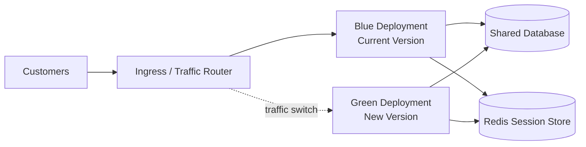
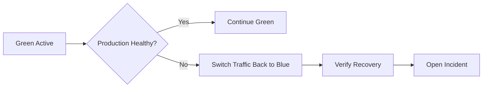
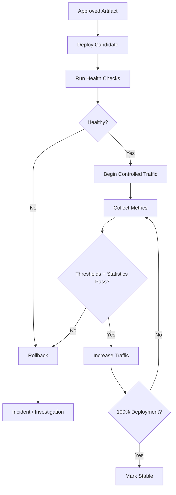

# NovaPay Deployment Strategies

## 1. Purpose

NovaPay uses zero-downtime deployment strategies to release banking services safely while protecting customer transactions, availability, and regulatory compliance.

The two supported production deployment patterns are:

- Blue-Green Deployment
- Canary Deployment

Both strategies are designed to support rapid rollback, controlled traffic movement, and continuous production verification.

---

# 2. Blue-Green Deployment Strategy

## 2.1 Architecture

Blue-green deployment maintains two production environments:

- **Blue** - currently serving live production traffic
- **Green** - contains the new application version

Both environments run simultaneously during the deployment window.

NovaPay uses Kubernetes workloads with separate blue and green deployments while sharing approved backend services such as the database and distributed session store.

Example topology:



---

## 2.2 Traffic Switching Protocol

Production traffic switching follows a controlled five-step sequence.

### Step 1 - Deploy Green

Deploy the new application version into the green environment while blue continues serving 100% of production traffic.

### Step 2 - Validate Green

Run:

- Health checks
- Readiness checks
- Smoke tests
- Payment API validation
- Database connectivity checks
- Security validation
- Metrics verification

Green must pass all required checks before receiving production traffic.

### Step 3 - Drain Blue Connections

Blue stops accepting new connections.

Existing requests and payment transactions are allowed to finish before traffic switching.

HTTP requests use a configurable graceful shutdown period.

Long-running payment operations receive an extended drain window.

### Step 4 - Switch Traffic

Update Kubernetes or service-mesh routing so that production traffic moves from blue to green.

Target state:

```text
Blue  = 0%
Green = 100%
```

Traffic switching must be atomic and auditable.

### Step 5 - Monitor and Retain Blue

Green becomes the active production environment.

Blue is retained temporarily as the rollback environment until post-deployment verification is complete.

---

# 3. Session Management

Customer sessions must not be stored only inside application pods.

NovaPay uses a distributed session store such as Redis so both blue and green instances can access valid session state.

This prevents:

- Customer logout during deployment
- Lost authentication sessions
- Session inconsistency during traffic switching

Session data must remain encrypted and protected by access controls.

---

# 4. Long-Running Transactions

Banking transactions can remain active during a deployment.

Examples include:

- Payment processing
- Settlement requests
- External banking API calls
- Database transactions

Before removing an old application version, NovaPay performs connection and transaction draining.

The previous deployment stops accepting new transactions while existing transactions are allowed to finish.

Recommended drain periods:

- HTTP traffic: approximately 30-60 seconds
- Long-running payment operations: up to 5 minutes where required

The assessment specifically identifies connection draining and long-running payment handling as critical banking considerations.

---

# 5. Blue-Green Rollback

If green fails production validation, traffic is immediately returned to blue.

Rollback flow:



Rollback conditions include:

- Health-check failures
- Excessive HTTP 5xx errors
- Transaction failures
- Database connectivity problems
- CrashLoopBackOff
- OOM events
- Severe latency degradation

The blue environment must not be destroyed until the defined production bake period has completed successfully.

---

# 6. Canary Deployment Strategy

## 6.1 Purpose

Canary deployment gradually exposes the new version to production traffic.

This reduces deployment risk by allowing NovaPay to compare the new release with the stable production baseline before full rollout.

---

# 7. Canary Phases

NovaPay follows a four-phase canary strategy.

## Phase 1 - Initial Canary

Traffic:

```text
1-2%
```

Duration:

```text
15 minutes
```

Success criteria:

- Error rate < 0.1%
- p99 latency < 200 ms
- Health checks passing
- No critical alerts

Action:

- Pass -> continue
- Fail -> automatic rollback

---

## Phase 2 - Early Adopter

Traffic:

```text
5-10%
```

Duration:

```text
30 minutes
```

Success criteria:

- Error rate < 0.05%
- No critical alerts
- No meaningful latency regression
- Payment success rate within accepted baseline

Action:

- Pass -> continue
- Fail -> rollback

---

## Phase 3 - Expansion

Traffic:

```text
25-50%
```

Duration:

```text
60 minutes
```

Success criteria:

- All application SLOs satisfied
- No statistically significant degradation
- Infrastructure resources healthy
- No compliance or security alerts

Action:

- Pass -> full rollout
- Fail -> rollback

---

## Phase 4 - Full Rollout

Traffic:

```text
100%
```

Bake period:

```text
24 hours
```

Success criteria:

- Complete SLO compliance
- Stable payment transaction success
- Error rate remains within baseline
- No severe production incidents
- No rollback trigger activated

After the bake period, the deployment is marked stable.

The assessment defines this four-phase progression and its expected success criteria. :contentReference[oaicite:1]{index=1}

---

# 8. Canary Metrics

The following metrics determine whether the deployment is promoted or rolled back.

## Application Metrics

- HTTP request success rate
- HTTP 5xx rate
- HTTP 4xx rate
- p95 latency
- p99 latency
- Requests per second

## Business Metrics

- Payment success rate
- Payment failure rate
- Transaction processing latency
- Transaction completion rate

## Infrastructure Metrics

- CPU utilization
- Memory utilization
- Pod restart count
- OOM events
- CrashLoopBackOff
- Database connection saturation

---

# 9. Statistical Analysis

Canary decisions are based on both thresholds and statistical comparison with the stable production version.

## 9.1 Latency

Welch's t-test is used to compare latency measurements between:

- Stable deployment
- Canary deployment

A statistically significant increase in latency indicates possible degradation.

## 9.2 Error Rate

Chi-squared testing is used to compare proportional error rates between stable and canary traffic.

## 9.3 Confidence Level

Automated canary promotion uses a:

```text
95% confidence level
```

## 9.4 Production Baseline

The canary is compared against a rolling production baseline.

Recommended baseline:

```text
Previous 7 days of production metrics
```

## 9.5 Composite Health Evaluation

Canary health combines:

- Latency
- Error rate
- Transaction success
- Resource utilization

Promotion happens only when the new version remains within approved limits.

The assessment specifically calls for Welch's t-test for latency, chi-squared testing for error-rate comparison, and a 95% confidence interval for automated promotion. :contentReference[oaicite:2]{index=2}

---

# 10. Canary Rollback

Rollback occurs when a mandatory threshold is breached.

Examples include:

### Immediate Conditions

- HTTP 5xx > 5% for 60 seconds
- Three consecutive health-check failures
- OOM kill
- CrashLoopBackOff
- Database connection pool exhaustion

### Escalated Conditions

- p99 latency > 2x baseline for 5 minutes
- Error budget burn rate > 10x normal for 10 minutes
- Transaction success rate falls more than 2% below baseline
- CPU > 90% for 5 minutes
- Memory > 85% for 5 minutes

These thresholds match the rollback trigger model defined in the assessment. :contentReference[oaicite:3]{index=3}

---

# 11. Kubernetes Implementation

NovaPay deployment manifests are stored under:

```text
kubernetes/blue-green/
kubernetes/canary/
kubernetes/analysis/
```

Existing repository artifacts include:

```text
kubernetes/blue-green/rollout.yaml
kubernetes/blue-green/services.yaml

kubernetes/canary/rollout.yaml
kubernetes/canary/service.yaml

kubernetes/analysis/success-rate.yaml
```

Argo CD is used for GitOps-based deployment synchronization.

Application definition:

```text
argocd/novapay-application.yaml
```

---

# 12. Zero-Downtime Requirements

A successful deployment must ensure:

- No customer-visible application outage
- Existing transactions complete safely
- Health probes remain operational
- Session state remains available
- Database schema remains backward compatible
- Rollback remains possible
- Deployment evidence remains auditable

---

# 13. Deployment Decision Flow



---

# 14. Audit Evidence

Each production deployment records:

- Commit SHA
- Container image digest
- Deployment strategy
- Deployment timestamp
- Approvers
- Canary phase timestamps
- Traffic percentages
- Prometheus metrics
- Statistical analysis results
- Argo CD synchronization history
- Rollback decision
- Incident ID when applicable

This provides traceability for engineering, security, compliance, and regulatory review.

---

# 15. Conclusion

NovaPay combines blue-green and canary deployment approaches to achieve zero-downtime releases.

Blue-green provides rapid traffic switching and immediate fallback, while canary deployments reduce risk through progressive exposure and metric-based statistical validation.

Together with Kubernetes, Argo CD, Prometheus, Grafana, controlled approvals, connection draining, and automated rollback, these strategies provide a production-safe deployment model for banking workloads.---

## Related Deliverables

- [Deliverable 1 – Pipeline Architecture](../01-pipeline-architecture/architecture.md)
- [Deliverable 3 – Compliance Gates](../03-compliance-gates/compliance-gates.md)
- [Deliverable 4 – Database Migration](../04-database-migration/database-migration-strategy.md)
- [Deliverable 5 – Environment Promotion](../05-environment-promotion/environment-promotion.md)
- [Deliverable 6 – Rollback Specification](../06-rollback-specification/rollback-specification.md)
- [Deliverable 7 – Deployment Runbook](../07-runbook-playbook/deployment-runbook.md)
- [Deliverable 8 – Observability](../08-observability/observability-strategy.md)
- [Incident Simulation](../09-incident-simulation/friday-5pm-incident.md)