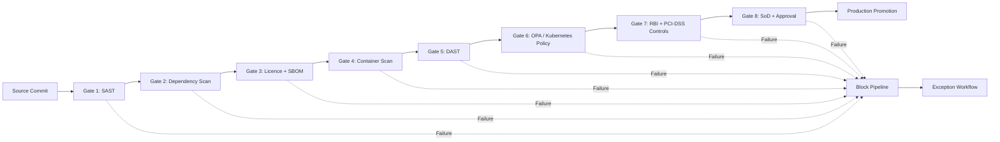
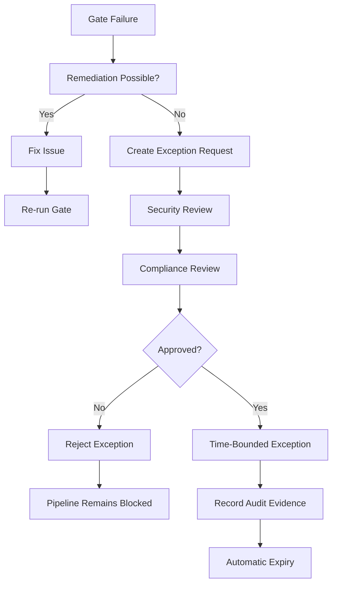

# NovaPay Compliance Gates

## 1. Purpose

NovaPay uses automated compliance gates throughout the CI/CD pipeline to prevent insecure, vulnerable, or non-compliant software from reaching production.

The compliance model supports:

- RBI-aligned technology risk controls
- PCI-DSS v4.0 controls
- Segregation of Duties (SoD)
- Application security
- Software supply-chain security
- Container security
- Infrastructure policy enforcement
- Complete audit traceability

All mandatory compliance gates operate using a **fail-closed** model.

If a mandatory gate fails, the artifact cannot be promoted until the issue is remediated or an authorized, time-bounded exception is approved.

---

# 2. Compliance Gate Architecture



---

# 3. Gate 1 - Static Application Security Testing (SAST)

## Purpose

Detect security vulnerabilities in NovaPay source code before an application artifact is produced.

## Checks

- Injection vulnerabilities
- Unsafe coding patterns
- Hard-coded secrets
- Authentication weaknesses
- Authorization weaknesses
- Insecure cryptographic usage

## Thresholds

| Severity | Allowed |
|---|---:|
| Critical | 0 |
| High | 0 |
| Medium | Maximum 5 with remediation plan |
| Low | Tracked for remediation |

## Failure Action

Critical or high-severity vulnerabilities immediately block the pipeline.

## Remediation

The developer must:

1. Review the scanner finding.
2. Correct the vulnerable code.
3. Commit the remediation.
4. Re-run the pipeline.
5. Verify that the vulnerability no longer appears.

---

# 4. Gate 2 - Dependency Vulnerability Scanning

## Purpose

Identify vulnerabilities in third-party packages used by the NovaPay application.

## Checks

- Known CVEs
- Outdated packages
- Critical dependency vulnerabilities
- Transitive dependencies
- Unsupported package versions

## Thresholds

| Severity | Allowed |
|---|---:|
| Critical | 0 |
| High | 0 unless formally approved |
| Medium | Maximum 5 with documented remediation |
| Low | Tracked |

## Failure Action

The pipeline stops when an unapproved critical or high-risk dependency vulnerability is identified.

## Remediation

Preferred remediation order:

1. Upgrade dependency.
2. Replace vulnerable dependency.
3. Remove unnecessary dependency.
4. Apply vendor patch.
5. Use formal exception workflow only when immediate remediation is impossible.

---

# 5. Gate 3 - Licence Compliance and SBOM

## Purpose

Protect NovaPay from unacceptable software licensing and software supply-chain risks.

## Checks

- Software Bill of Materials generated
- Dependency inventory complete
- Licence information recorded
- Prohibited licences detected
- Unknown dependencies detected

## Thresholds

- Missing SBOM: **FAIL**
- Prohibited licence: **0 allowed**
- Unknown critical dependency: **0 allowed**
- Unapproved dependency: **0 allowed**

## Licence Policy

Permissive licences such as approved MIT and Apache-style licences may be accepted according to NovaPay policy.

Restrictive or incompatible licences require legal/compliance review before use.

## Failure Action

The artifact cannot proceed until licence or SBOM issues are resolved.

---

# 6. Gate 4 - Container Vulnerability Scanning

## Purpose

Validate the final NovaPay container image before deployment.

## Checks

- Operating-system package vulnerabilities
- Application dependency vulnerabilities
- Container configuration
- Base-image risks
- Image provenance

## Thresholds

| Severity | Allowed |
|---|---:|
| Critical | 0 |
| High | 0 unless formally approved |
| Medium | Maximum 10 with remediation plan |
| Low | Tracked |

Additional requirements:

- Container image must use an approved base image.
- Image digest must be recorded.
- Artifact must be immutable after approval.

## Failure Action

Critical or unapproved high-severity vulnerabilities block deployment.

## Remediation

Rebuild the image using:

- Patched dependencies
- Updated base image
- Corrected application packages

The corrected image must pass the complete scanning process again.

---

# 7. Gate 5 - Dynamic Application Security Testing (DAST)

## Purpose

Detect runtime application vulnerabilities against a deployed NovaPay test environment.

## Tool

OWASP ZAP is integrated into the pipeline.

## Checks

- Injection vulnerabilities
- Authentication problems
- Security header issues
- Runtime application weaknesses
- API exposure

## Thresholds

| Severity | Allowed |
|---|---:|
| Critical | 0 |
| High | 0 |
| Medium | Maximum 5 with remediation |
| Low | Recorded |

## Failure Action

Critical or high-severity DAST findings block environment promotion.

## Remediation

The application team fixes the runtime vulnerability and repeats DAST before promotion.

---

# 8. Gate 6 - Kubernetes and OPA Policy Validation

## Purpose

Prevent insecure Kubernetes resources from being deployed.

## Tools

- Open Policy Agent (OPA)
- Rego
- Conftest

Repository policies:

```text
policies/compliance.rego
policies/compliance-controls.yaml
```

Copies for the assessment pipeline structure are stored under:

```text
pipeline/policies/
```

## Checks

Policies can validate:

- Privileged containers
- Root execution
- Resource limits
- Required labels
- Approved registries
- Security contexts
- Host networking
- Required probes
- Deployment configuration

## Thresholds

- Critical policy violations: **0**
- Privileged containers: **0**
- Unapproved host networking: **0**
- Missing mandatory security controls: **0**

## Failure Action

Any mandatory OPA policy violation blocks deployment.

## Remediation

Correct the Kubernetes manifest and re-run policy validation.

---

# 9. Gate 7 - RBI and PCI-DSS Compliance

## Purpose

Ensure NovaPay deployment controls are aligned with banking security and payment-card compliance requirements defined for this assessment.

## Control Areas

### RBI-Aligned Controls

Pipeline controls provide evidence for:

- Change management
- Security testing
- Access control
- Technology risk management
- Audit logging
- Incident management
- Controlled production deployment

### PCI-DSS v4.0

The pipeline supports controls relating to:

- Secure software development
- Vulnerability management
- Change control
- Access restrictions
- Security testing
- Auditability

## Thresholds

- Failed mandatory regulatory control: **0**
- Missing required audit evidence: **0**
- Unauthorized deployment: **0**
- Unapproved security exception: **0**

## Failure Action

Production promotion remains blocked until the compliance requirement is satisfied.

---

# 10. Gate 8 - Segregation of Duties and Production Approval

## Purpose

Prevent one individual from independently developing, approving, and deploying a production change.

## Required Roles

Typical roles include:

- Developer
- Technical Lead
- Security/Compliance Reviewer
- Release Manager
- SRE Lead

## Production Approval

Production promotion requires authorized approval according to NovaPay's RBAC model.

A developer cannot independently approve their own production change.

## Thresholds

- Required approvals missing: **FAIL**
- Self-approval: **FAIL**
- Unauthorized production actor: **FAIL**
- Approval record missing: **FAIL**

## Failure Action

Production deployment remains blocked.

---

# 11. Compliance Gate Summary

| Gate | Control | Primary Threshold | Failure Action |
|---|---|---|---|
| 1 | SAST | Critical = 0, High = 0 | Block |
| 2 | Dependency Scan | Critical = 0 | Block |
| 3 | Licence + SBOM | Missing SBOM = 0 | Block |
| 4 | Container Scan | Critical = 0 | Block |
| 5 | DAST | Critical = 0, High = 0 | Block |
| 6 | OPA/Kubernetes | Mandatory violations = 0 | Block |
| 7 | RBI/PCI-DSS | Failed mandatory controls = 0 | Block |
| 8 | SoD/Approval | Missing approvals = 0 | Block |

NovaPay therefore implements **eight compliance gates**, exceeding the assessment minimum of six.

---

# 12. Exception Workflow

Exceptions are permitted only when immediate remediation is not operationally possible and the remaining risk has been formally reviewed.



## Exception Requirements

Every exception must contain:

- Exception ID
- Pipeline run ID
- Commit SHA
- Artifact digest
- Failed control
- Vulnerability or finding
- Severity
- Business justification
- Compensating controls
- Risk owner
- Security approver
- Compliance approver
- Creation timestamp
- Expiry timestamp
- Remediation owner

## Time Limits

Recommended maximum exception periods:

| Severity | Maximum Exception |
|---|---|
| Critical | Emergency-only approval; maximum 24 hours |
| High | Maximum 7 days |
| Medium | Maximum 30 days |
| Low | Normal remediation backlog |

Exceptions automatically expire.

An expired exception causes the associated compliance gate to fail again.

---

# 13. Segregation of Duties for Exceptions

The person requesting an exception cannot be the sole approver.

For high-risk production exceptions:

```text
Requester
   ↓
Security Reviewer
   ↓
Compliance/Risk Reviewer
   ↓
Release Authorization
```

This creates independent review and prevents unauthorized bypass of security controls.

---

# 14. Audit Trail

Every compliance gate execution must generate structured evidence.

Example audit record:

```json
{
  "pipeline_run_id": "123456",
  "commit_sha": "abc123",
  "artifact": "novapay-payment-api",
  "artifact_digest": "sha256:example",
  "gate": "container-security",
  "status": "PASS",
  "critical_findings": 0,
  "high_findings": 0,
  "exception_id": null,
  "approver": null,
  "timestamp": "2026-09-03T12:00:00Z"
}
```

Audit records must allow NovaPay to determine:

- What was deployed
- Who approved it
- Which security checks executed
- Which policies passed
- Whether an exception existed
- When the deployment occurred
- Which artifact reached production

---

# 15. Evidence Retention

Compliance evidence includes:

- GitHub Actions logs
- SAST reports
- Dependency reports
- SBOM
- Licence scan results
- Container vulnerability reports
- OWASP ZAP results
- OPA decisions
- Approval history
- Exception records
- Container image digest
- Argo CD deployment history
- Incident and rollback records

Evidence must be protected against unauthorized modification.

---

# 16. OPA Policy Examples

The repository contains the main OPA policy implementation in:

```text
policies/compliance.rego
```

Example policy patterns include the following.

## Policy 1 - Block Privileged Containers

```rego
package novapay.compliance

deny[msg] {
    container := input.spec.template.spec.containers[_]
    container.securityContext.privileged == true
    msg := sprintf("Privileged container is prohibited: %s", [container.name])
}
```

## Policy 2 - Require Resource Limits

```rego
deny[msg] {
    container := input.spec.template.spec.containers[_]
    not container.resources.limits
    msg := sprintf("Resource limits are required for container: %s", [container.name])
}
```

## Policy 3 - Block Host Networking

```rego
deny[msg] {
    input.spec.template.spec.hostNetwork == true
    msg := "hostNetwork is prohibited for NovaPay workloads"
}
```

These examples demonstrate policy-as-code enforcement for Kubernetes deployment controls.

---

# 17. Gate Orchestration

Compliance gates execute before production promotion.

```text
Commit
  |
  v
Build
  |
  v
Tests
  |
  v
SAST
  |
  v
Dependency Scan
  |
  v
Licence + SBOM
  |
  v
Container Scan
  |
  v
DAST
  |
  v
OPA / Kubernetes Policy
  |
  v
RBI / PCI-DSS Validation
  |
  v
SoD Approval
  |
  v
Production
```

A failure at any mandatory stage stops forward promotion.

---

# 18. Compliance Evidence Mapping

| Control Area | Pipeline Evidence |
|---|---|
| Secure Development | SAST and test reports |
| Vulnerability Management | Dependency/container scans |
| Application Security | SAST + DAST |
| Software Supply Chain | SBOM + licence validation |
| Infrastructure Security | OPA policy decisions |
| Change Management | Git history + pipeline run |
| Access Control | RBAC + production approvals |
| Segregation of Duties | Independent approval evidence |
| Deployment Governance | Argo CD history |
| Incident Management | Incident/playbook records |
| Auditability | Structured gate evidence |

---

# 19. Failure Handling

Compliance gates use fail-closed behavior.

If a scanner or policy engine cannot produce a trustworthy result because of an infrastructure failure, the pipeline does not assume success.

Allowed response:

1. Retry the failed scanner when the failure is transient.
2. If retry fails, stop the pipeline.
3. Investigate the tool or infrastructure failure.
4. Resume only after trustworthy compliance evidence can be generated.

---

# 20. Conclusion

NovaPay's CI/CD compliance model integrates security, policy-as-code, regulatory controls, software supply-chain validation, and segregation of duties directly into the deployment process.

Eight compliance gates prevent unsafe or unauthorized changes from progressing to production.

Numeric thresholds, automated blocking, formal exceptions, independent approvals, and structured audit evidence provide a defensible compliance model for the NovaPay banking CI/CD pipeline.---

## Related Deliverables

- [Deliverable 1 – Pipeline Architecture](../01-pipeline-architecture/architecture.md)
- [Deliverable 2 – Deployment Strategies](../02-deployment-strategies/deployment-strategy.md)
- [Deliverable 4 – Database Migration](../04-database-migration/database-migration-strategy.md)
- [Deliverable 5 – Environment Promotion](../05-environment-promotion/environment-promotion.md)
- [Deliverable 6 – Rollback Specification](../06-rollback-specification/rollback-specification.md)
- [Deliverable 7 – Deployment Runbook](../07-runbook-playbook/deployment-runbook.md)
- [Deliverable 8 – Observability](../08-observability/observability-strategy.md)
- [Incident Simulation](../09-incident-simulation/friday-5pm-incident.md)
- [Assessment Corrections / ERRATA](../../ERRATA.md)