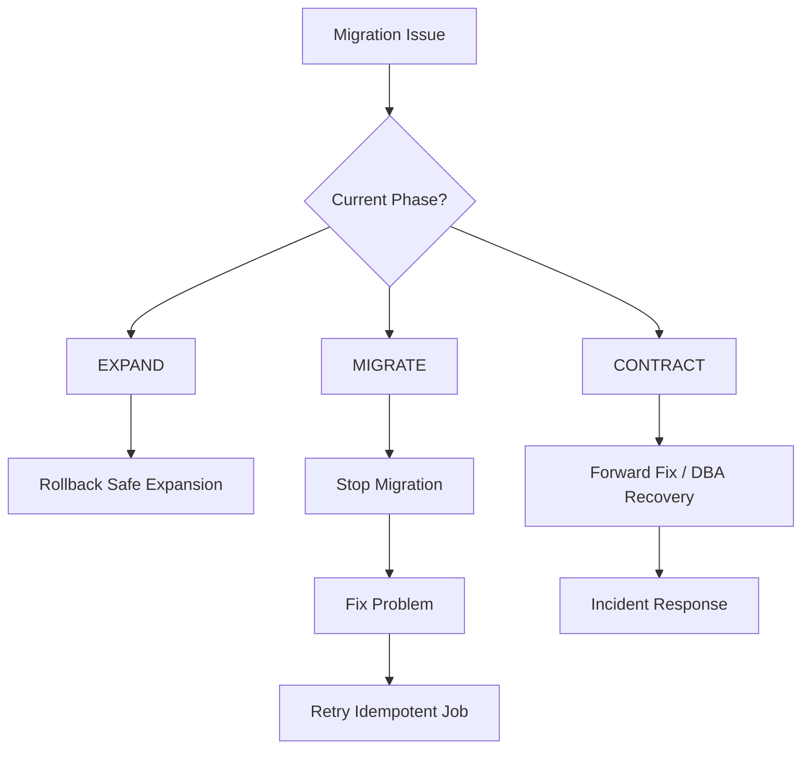

# NovaPay Zero-Downtime Database Migration Strategy

## 1. Purpose

NovaPay uses the **Expand-Migrate-Contract** pattern to perform production database schema changes without interrupting payment services.

The primary objectives are:

- Zero application downtime
- Backward compatibility
- Safe data backfill
- Controlled schema removal
- Independent deployment of each migration phase
- Automated monitoring and abort criteria
- Complete auditability

The migration lifecycle is:

```text
EXPAND → MIGRATE → VALIDATE → CONTRACT
```

---

# 2. Architecture

```mermaid
flowchart LR
    A[Existing Schema]
    B[EXPAND]
    C[Backward-Compatible Schema]
    D[Deploy Application V(N)]
    E[MIGRATE / Backfill]
    F[Validate Data]
    G{Validation Passed?}
    H[CONTRACT]
    I[Final Schema]
    J[Abort / Retry]

    A --> B
    B --> C
    C --> D
    D --> E
    E --> F
    F --> G

    G -- Yes --> H
    H --> I

    G -- No --> J
    J --> E
```

---

# 3. Phase 1 - Expand

## Purpose

Add new database structures without removing or modifying structures required by the currently running application.

Examples include:

- Adding nullable columns
- Adding new tables
- Adding indexes using safe online operations
- Adding backward-compatible relationships

Repository examples:

```text
database/expand/001_initial_schema.sql
database/expand/002_add_payment_reference.sql
```

## Compatibility Requirement

During the Expand phase, both application versions must remain functional:

```text
Application V(N-1) → Compatible
Application V(N)   → Compatible
```

No destructive schema changes are allowed.

## Validation

Before proceeding:

- Schema creation succeeds
- Existing application remains healthy
- New application can access the expanded schema
- Existing transactions continue normally
- Query latency remains within accepted limits

## Failure Handling

If the Expand operation fails before the new application depends on the new structures, the newly introduced structures may be removed where safe.

The assessment defines Expand as backward compatible so both V(N-1) and V(N) can operate against the schema. :contentReference[oaicite:1]{index=1}

---

# 4. Phase 2 - Application Deployment

After successful expansion, deploy the new NovaPay application version.

The new application must support the transition state.

For example:

```text
Old schema field + New schema field
```

may temporarily coexist.

The application must not immediately require removal of the legacy field.

This enables safe rollback to V(N-1).

---

# 5. Phase 3 - Migrate

## Purpose

Move or backfill existing production data into the new schema.

Repository migration scripts include:

```text
database/migrate/001_seed_legacy_data.sql
database/migrate/002_backfill_payment_reference.sql
```

## Migration Requirements

Migration jobs must be:

- Idempotent
- Restartable
- Observable
- Throttled
- Auditable

## Idempotency

Running the migration multiple times must not corrupt or duplicate data.

Conceptually:

```sql
UPDATE payments
SET payment_reference = generated_reference
WHERE payment_reference IS NULL;
```

Only rows requiring migration should be modified.

---

# 6. Batch Processing

Large production tables must not be migrated in a single blocking operation.

Data should be processed in controlled batches.

Example:

```text
Batch 1 → Validate
Batch 2 → Validate
Batch 3 → Validate
...
Final Batch → Validate
```

Benefits include:

- Reduced database load
- Lower lock contention
- Controlled resource consumption
- Easier recovery
- Better observability

---

# 7. Migration Throttling

Migration throughput must adapt to production health.

Monitor:

- Database CPU
- Database memory
- Query latency
- Connection utilization
- Lock waits
- Transaction throughput
- Payment API latency

If production performance degrades, the migration should slow down or stop.

---

# 8. Automatic Abort Criterion

The assessment specifies that the migration should automatically abort if query latency increases by more than:

```text
20%
```

relative to the accepted baseline. :contentReference[oaicite:2]{index=2}

Decision logic:

```text
Query latency increase <= 20%
        |
        +---- Continue migration

Query latency increase > 20%
        |
        +---- Abort migration
        +---- Alert DBA/SRE
        +---- Investigate
```

---

# 9. Data Validation

After migration, NovaPay validates:

- Row counts
- Null values
- Referential integrity
- Payment references
- Duplicate records
- Transaction totals
- Application health
- Database errors

Example validation:

```sql
SELECT COUNT(*)
FROM payments
WHERE payment_reference IS NULL;
```

Expected result after successful backfill:

```text
0
```

---

# 10. Compatibility Matrix

| Migration State | App V(N-1) | App V(N) | Rollback |
|---|---|---|---|
| Before Expand | Supported | Not deployed | Yes |
| After Expand | Supported | Supported | Yes |
| During Migrate | Supported | Supported | Yes |
| After Migrate | Supported | Supported | Yes |
| After Contract | Not guaranteed | Supported | Forward-only |

The critical rule is:

> Do not execute CONTRACT until the old application version is no longer required.

---

# 11. Phase 4 - Contract

## Purpose

Remove obsolete database structures only after all services have migrated to the new schema.

Repository example:

```text
database/contract/001_enforce_payment_reference.sql
```

Possible Contract operations include:

- Removing obsolete columns
- Removing legacy tables
- Enforcing new constraints
- Removing temporary compatibility logic

---

# 12. Contract Approval Gate

The Contract phase is higher risk because destructive changes may be irreversible.

Therefore it must execute as a **separate deployment** with its own approval gate.

Required validation before approval:

- V(N) stable in production
- No service depends on legacy schema
- Backfill completed
- Data validation passed
- Production metrics healthy
- Rollback window evaluated
- DBA approval obtained
- Release approval obtained

The assessment explicitly requires Contract to be treated as a separate deployment because it is forward-only. :contentReference[oaicite:3]{index=3}

---

# 13. Rollback Strategy

Rollback differs by migration phase.

## Expand Failure

Possible action:

```text
Remove newly added unused structures
```

only when safe.

Application V(N-1) remains operational.

## Migrate Failure

The migration is designed to be idempotent.

Action:

```text
Stop → Correct issue → Resume/Retry
```

Already migrated data must not be corrupted or duplicated.

## Application Failure

Before Contract:

```text
V(N) → rollback → V(N-1)
```

because the schema remains backward compatible.

## Contract Failure

Contract is treated as forward-only.

Recovery normally requires:

- Forward fix
- Restore from approved backup where necessary
- DBA intervention
- Incident process

---

# 14. Rollback Decision Flow



---

# 15. Online Schema Migration

For large production tables, online schema migration tooling should be considered.

The assessment identifies examples such as:

```text
MySQL:
- gh-ost
- pt-online-schema-change

PostgreSQL:
- pgroll
```

These approaches are intended to reduce table-level locking during schema migration. :contentReference[oaicite:4]{index=4}

---

# 16. Monitoring

Prometheus/Grafana monitoring should observe database and application behavior throughout migration.

Important signals:

```text
database_query_latency
database_connections
database_lock_waits
migration_rows_processed
migration_failures
payment_success_rate
http_5xx_rate
application_p99_latency
```

---

# 17. Migration Alerts

Alert conditions include:

| Condition | Action |
|---|---|
| Query latency increase >20% | Abort migration + alert DBA |
| Database connectivity failure | Stop migration |
| Excessive lock contention | Pause/abort |
| Payment success degradation | Pause + investigate |
| Migration job failure | Stop + retry after remediation |
| Data validation failure | Block Contract |
| Critical production alert | Abort migration |

---

# 18. Database Migration CI/CD Flow

```mermaid
flowchart TD
    A[Schema Change PR]
    B[Review Migration]
    C[Test Migration]
    D[EXPAND]
    E[Deploy App V(N)]
    F[MIGRATE]
    G[Validate Data]
    H[Production Bake Period]
    I[Contract Approval]
    J[CONTRACT]
    K[Final Validation]

    A --> B
    B --> C
    C --> D
    D --> E
    E --> F
    F --> G
    G --> H
    H --> I
    I --> J
    J --> K
```

---

# 19. Segregation of Duties

Production database migrations require controlled authorization.

Typical responsibilities:

### Developer

Creates:

- Application changes
- Migration scripts

### Technical Reviewer

Reviews:

- SQL safety
- Backward compatibility
- Migration logic

### DBA

Reviews:

- Production database impact
- Query performance
- Locking risks
- Recovery strategy

### Release Manager

Authorizes controlled production execution.

The developer must not independently approve a destructive production schema change.

---

# 20. Backup and Recovery

Before destructive Contract operations:

- Confirm approved backup exists
- Verify recovery procedure
- Record backup reference
- Confirm database health
- Confirm recovery ownership

Backup availability does not replace backward-compatible migration design.

---

# 21. Audit Evidence

Each migration records:

- Migration ID
- Commit SHA
- Pipeline run ID
- Script name
- Environment
- Start timestamp
- Completion timestamp
- Application version
- Database schema version
- Rows processed
- Validation results
- Performance metrics
- Approvers
- Abort events
- Retry events
- Incident ID if applicable

Example:

```json
{
  "migration_id": "NOVAPAY-DB-002",
  "phase": "MIGRATE",
  "script": "002_backfill_payment_reference.sql",
  "status": "SUCCESS",
  "rows_processed": 10000,
  "validation": "PASS",
  "query_latency_change_percent": 4.2
}
```

---

# 22. Zero-Downtime Guarantees

The strategy maintains service availability by ensuring:

1. Schema expansion is backward compatible.
2. New application versions support the transition schema.
3. Data backfill is performed separately.
4. Migration jobs are idempotent.
5. Production database load is monitored.
6. Migration automatically stops on unacceptable degradation.
7. Legacy schema remains until the new version is stable.
8. Contract changes require separate approval.

---

# 23. Repository Implementation

NovaPay database migration artifacts are stored under:

```text
database/
├── expand/
│   ├── 001_initial_schema.sql
│   └── 002_add_payment_reference.sql
│
├── migrate/
│   ├── 001_seed_legacy_data.sql
│   └── 002_backfill_payment_reference.sql
│
└── contract/
    └── 001_enforce_payment_reference.sql
```

---

# 24. Conclusion

NovaPay uses the **Expand-Migrate-Contract** pattern to safely evolve the banking database without requiring application downtime.

The strategy maintains compatibility between application versions, performs controlled and idempotent data migration, monitors production impact, automatically aborts when query latency increases by more than 20%, and isolates destructive Contract operations behind a separate approval gate.

This provides a controlled zero-downtime database migration process suitable for NovaPay's CI/CD architecture.---

## Related Deliverables

- [Deliverable 1 – Pipeline Architecture](../01-pipeline-architecture/architecture.md)
- [Deliverable 2 – Deployment Strategies](../02-deployment-strategies/deployment-strategy.md)
- [Deliverable 3 – Compliance Gates](../03-compliance-gates/compliance-gates.md)
- [Deliverable 5 – Environment Promotion](../05-environment-promotion/environment-promotion.md)
- [Deliverable 6 – Rollback Specification](../06-rollback-specification/rollback-specification.md)
- [Deliverable 7 – Deployment Runbook](../07-runbook-playbook/deployment-runbook.md)
- [Deliverable 8 – Observability](../08-observability/observability-strategy.md)
- [Incident Simulation](../09-incident-simulation/friday-5pm-incident.md)