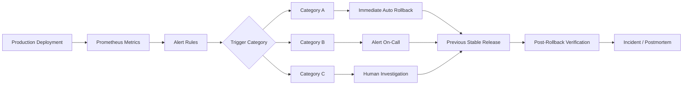
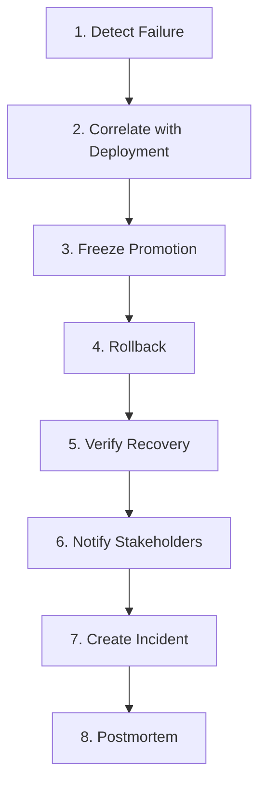

# NovaPay Automated Rollback Specification

## 1. Purpose

NovaPay uses automated rollback as the primary production safety mechanism for rapid software delivery.

The rollback system continuously evaluates production health after deployment and restores the previous known-good release when defined failure conditions are detected.

Rollback objectives are:

- Protect payment availability
- Minimize customer impact
- Restore production quickly
- Prevent continued exposure to a faulty release
- Preserve audit evidence
- Trigger incident management when required

NovaPay defines three rollback categories:

```text
Category A → Immediate automated rollback (<60 seconds)

Category B → Escalated rollback (<15 minutes)

Category C → Manual decision
```

The assessment defines these three trigger categories and their expected behavior. :contentReference[oaicite:2]{index=2}

---

# 2. Rollback Architecture



---

# 3. Category A - Immediate Rollback

## Objective

Category A represents severe production failures requiring automatic action without waiting for human approval.

Target rollback time:

```text
< 60 seconds
```

These conditions trigger immediate traffic re-routing to the previous stable version with zero human intervention. :contentReference[oaicite:3]{index=3}

---

## 3.1 Trigger A1 - HTTP 5xx Error Rate

### Condition

```text
HTTP 5xx rate > 5%
```

sustained for:

```text
60 seconds
```

### Detection

Prometheus evaluates HTTP request metrics.

### Action

Immediately stop rollout and route production traffic to the previous stable version.

---

## 3.2 Trigger A2 - Health Check Failures

### Condition

```text
3 consecutive health-check failures
```

### Detection

Kubernetes readiness/liveness probes and Prometheus health monitoring.

### Action

Immediately rollback.

---

## 3.3 Trigger A3 - OOM Kill

### Condition

```text
Container terminated because of OOM
```

### Detection

Kubernetes container termination metrics.

### Action

Immediately rollback to previous known-good release.

---

## 3.4 Trigger A4 - CrashLoopBackOff

### Condition

Application pods enter:

```text
CrashLoopBackOff
```

### Detection

Kubernetes pod-state monitoring.

### Action

Immediately stop rollout and restore the stable release.

---

## 3.5 Trigger A5 - Database Connection Pool Exhaustion

### Condition

Application is unable to obtain required database connections because the connection pool is exhausted.

### Detection

Database/application connection-pool metrics.

### Action

Immediately route traffic away from the candidate deployment.

---

# 4. Category A Summary

| Trigger | Threshold | Detection | Action |
|---|---|---|---|
| HTTP 5xx | >5% for 60 seconds | Prometheus | Auto rollback |
| Health Check | 3 consecutive failures | Kubernetes/Prometheus | Auto rollback |
| OOM Kill | OOM event detected | Kubernetes | Auto rollback |
| CrashLoopBackOff | Pod enters failed restart loop | Kubernetes | Auto rollback |
| DB Pool Exhaustion | Connection pool exhausted | Application/DB metrics | Auto rollback |

These five triggers are explicitly identified in the assessment. :contentReference[oaicite:4]{index=4}

---

# 5. Category B - Escalated Rollback

## Objective

Category B covers serious degradation that may not require an immediate sub-minute rollback but must be resolved within an escalation window.

Target:

```text
< 15 minutes
```

The on-call engineer is alerted.

If no response occurs within the escalation window, the deployment is automatically rolled back. :contentReference[oaicite:5]{index=5}

---

## 5.1 Trigger B1 - p99 Latency Regression

### Condition

```text
p99 latency > 2x production baseline
```

for:

```text
5 minutes
```

### Detection

Prometheus latency histogram/query.

### Action

Alert on-call SRE.

If unresolved within the escalation period, automatically rollback.

---

## 5.2 Trigger B2 - Error Budget Burn Rate

### Condition

```text
Error budget burn rate > 10x normal
```

for:

```text
10 minutes
```

### Detection

Prometheus SLO/error-budget metrics.

### Action

Alert on-call and initiate escalation.

Rollback automatically if no timely response is received.

---

## 5.3 Trigger B3 - Transaction Success Rate

### Condition

```text
Transaction success rate >2% below baseline
```

### Detection

NovaPay payment business metrics.

### Action

Escalate to SRE/application owner.

Rollback if not resolved during the escalation window.

---

## 5.4 Trigger B4 - Resource Saturation

### CPU Condition

```text
CPU > 90%
```

sustained for:

```text
5 minutes
```

### Memory Condition

```text
Memory > 85%
```

sustained for:

```text
5 minutes
```

### Detection

Prometheus/Kubernetes infrastructure metrics.

### Action

Alert the on-call engineer and begin escalation.

Rollback automatically when the escalation policy requires it.

---

# 6. Category B Summary

| Trigger | Threshold | Duration | Action |
|---|---|---|---|
| p99 Latency | >2x baseline | 5 min | Escalate / rollback |
| Error Budget Burn | >10x normal | 10 min | Escalate / rollback |
| Transaction Success | >2% below baseline | Defined evaluation window | Escalate / rollback |
| CPU Saturation | >90% | 5 min | Escalate / rollback |
| Memory Saturation | >85% | 5 min | Escalate / rollback |

These thresholds come directly from the assessment rollback strategy. :contentReference[oaicite:6]{index=6}

---

# 7. Category C - Manual Decision

Category C represents production degradation that requires human analysis because the available metrics do not justify an automatic rollback.

Examples specified by the assessment include:

- Gradual degradation below automated thresholds
- Customer support reports
- Retroactive compliance failure
- Downstream dependency correlation

These conditions surface warnings but require human judgment. :contentReference[oaicite:7]{index=7}

---

# 8. Rollback Decision Matrix

| Category | Response Time | Decision Type | Primary Owner |
|---|---:|---|---|
| Category A | <60 sec | Fully automated | Platform/SRE automation |
| Category B | <15 min | Escalated + automatic fallback | On-call SRE |
| Category C | Manual | Human decision | Incident Commander / SRE Lead |

---

# 9. Eight-Step Rollback Execution Workflow

The assessment requires the rollback workflow to contain:

```text
Detect → Correlate → Freeze → Rollback → Verify → Notify → Incident → Postmortem
```

:contentReference[oaicite:8]{index=8}

---

## Step 1 - Detect

Prometheus, Kubernetes, application telemetry, and business metrics detect abnormal production behavior.

Examples:

- Increased 5xx rate
- Failed health probes
- Latency increase
- Payment failure increase
- Pod crashes
- Resource exhaustion

---

## Step 2 - Correlate

Determine whether the failure correlates with the latest deployment.

Correlation evidence includes:

- Deployment timestamp
- Application version
- Git commit SHA
- Container digest
- Argo CD deployment history
- Metric changes before and after deployment

Example:

```text
Deployment: 17:00
Error spike: 17:01
Candidate version affected: v2.4.1

Result: High deployment correlation
```

---

## Step 3 - Freeze

Immediately stop further promotion activities.

Actions include:

- Pause canary progression
- Stop additional production deployments
- Freeze environment promotion
- Prevent candidate artifact from receiving additional traffic

For severe incidents, production deployment permissions may be temporarily restricted.

---

## Step 4 - Rollback

Restore the previous stable application version.

### Blue-Green

Traffic is switched from the faulty environment back to the previous stable environment.

Example:

```text
Green v2.4.1 → 0%
Blue  v2.4.0 → 100%
```

### Canary

Candidate traffic is reduced to:

```text
0%
```

Stable traffic returns to:

```text
100%
```

Argo Rollouts or the production deployment controller performs the traffic change.

---

## Step 5 - Verify

After rollback, verify that production has returned to normal.

Required checks include:

- Health checks passing
- Readiness checks passing
- HTTP 5xx returned to normal
- p99 latency returned to baseline
- Payment success restored
- Database connections healthy
- Pods stable
- CPU/memory healthy
- Smoke tests successful

The assessment explicitly requires smoke tests, metric comparison, and customer impact assessment during post-rollback verification. :contentReference[oaicite:9]{index=9}

---

## Step 6 - Notify

Notify affected operational stakeholders.

Typical recipients:

- On-call SRE
- Application team
- Release Manager
- Incident Commander
- Security/Compliance team where relevant
- Business stakeholders for customer-impacting incidents

Example notification:

```text
NovaPay production rollback executed.

Failed version: v2.4.1
Restored version: v2.4.0
Trigger: HTTP 5xx >5% for 60 seconds
Rollback status: Successful
Production verification: In progress
```

---

## Step 7 - Incident

Create an incident record when production impact meets the incident criteria.

The incident record should contain:

- Incident ID
- Deployment version
- Trigger
- Detection timestamp
- Rollback timestamp
- Recovery timestamp
- Customer impact
- Responsible teams
- Evidence links

NovaPay's detailed incident-response procedure is documented under:

```text
docs/07-runbook-playbook/incident-response-playbook.md
```

---

## Step 8 - Postmortem

For qualifying production failures, conduct a postmortem.

Review:

- What changed
- Why the deployment failed
- Why automated gates did not prevent the issue
- Detection effectiveness
- Rollback effectiveness
- Customer impact
- Corrective actions
- Preventive controls

Template:

```text
docs/07-runbook-playbook/postmortem-template.md
```

---

# 10. Workflow Diagram



---

# 11. Post-Rollback Verification

Rollback is not considered successful solely because the previous version was redeployed.

A formal verification must be completed.

## Smoke Tests

Execute:

```text
GET /health
GET /ready
```

Expected result:

```text
HTTP 200
```

Execute a controlled payment API smoke test where appropriate.

---

## Metric Comparison

Compare current production metrics with the pre-deployment baseline.

Validate:

- HTTP 5xx rate
- p99 latency
- Request success
- Payment transaction success
- CPU
- Memory
- Pod restart rate
- Database connectivity

Expected result:

```text
Metrics restored to normal/baseline range
```

---

## Customer Impact Assessment

Determine:

- Number of affected requests
- Number of failed payments
- Duration of impact
- Customers potentially affected
- Transactions requiring reconciliation

The assessment explicitly includes customer impact assessment as part of post-rollback verification. :contentReference[oaicite:10]{index=10}

---

# 12. Rollback Audit Evidence

Every rollback should generate an auditable record.

Example:

```json
{
  "incident_id": "INC-NOVAPAY-001",
  "deployment_version": "v2.4.1",
  "stable_version": "v2.4.0",
  "commit_sha": "abc123",
  "trigger_category": "A",
  "trigger": "HTTP_5XX_RATE",
  "threshold": ">5% for 60s",
  "detected_at": "2026-09-03T17:01:00Z",
  "rollback_started_at": "2026-09-03T17:01:05Z",
  "rollback_completed_at": "2026-09-03T17:01:42Z",
  "verification": "PASS"
}
```

---

# 13. Prometheus Alert Rule Examples

Create Prometheus rules for the rollback triggers.

Example configuration:

```yaml
groups:
  - name: novapay-rollback-alerts
    rules:

      - alert: NovaPayHigh5xxRate
        expr: |
          (
            sum(rate(http_requests_total{status=~"5.."}[1m]))
            /
            sum(rate(http_requests_total[1m]))
          ) > 0.05
        for: 60s
        labels:
          severity: critical
          rollback_category: A
        annotations:
          summary: "NovaPay HTTP 5xx rate exceeds 5%"
          action: "Immediate automated rollback"

      - alert: NovaPayHealthCheckFailure
        expr: up{job="novapay"} == 0
        labels:
          severity: critical
          rollback_category: A
        annotations:
          summary: "NovaPay application health check failed"
          action: "Evaluate consecutive failures and rollback"

      - alert: NovaPayContainerOOMKilled
        expr: |
          kube_pod_container_status_last_terminated_reason{
            reason="OOMKilled"
          } == 1
        labels:
          severity: critical
          rollback_category: A
        annotations:
          summary: "NovaPay container OOMKilled"
          action: "Immediate automated rollback"

      - alert: NovaPayCrashLoopBackOff
        expr: |
          kube_pod_container_status_waiting_reason{
            reason="CrashLoopBackOff"
          } == 1
        labels:
          severity: critical
          rollback_category: A
        annotations:
          summary: "NovaPay pod entered CrashLoopBackOff"
          action: "Immediate automated rollback"

      - alert: NovaPayHighP99Latency
        expr: |
          histogram_quantile(
            0.99,
            sum(rate(http_request_duration_seconds_bucket[5m])) by (le)
          )
          > 2 * novapay_latency_p99_baseline
        for: 5m
        labels:
          severity: high
          rollback_category: B
        annotations:
          summary: "NovaPay p99 latency exceeds 2x baseline"
          action: "Alert on-call and begin rollback escalation"

      - alert: NovaPayHighCPU
        expr: |
          novapay_cpu_utilization_percent > 90
        for: 5m
        labels:
          severity: high
          rollback_category: B
        annotations:
          summary: "NovaPay CPU exceeds 90%"
          action: "Begin Category B escalation"

      - alert: NovaPayHighMemory
        expr: |
          novapay_memory_utilization_percent > 85
        for: 5m
        labels:
          severity: high
          rollback_category: B
        annotations:
          summary: "NovaPay memory exceeds 85%"
          action: "Begin Category B escalation"
```

These rule examples implement the threshold model specified by the assessment; metric names that depend on the deployed monitoring stack are illustrative and must match the actual exported Prometheus metrics during implementation.

---

# 14. Rollback with Blue-Green Deployment

For blue-green releases:

```text
Before release:

Blue  = 100%
Green = 0%

After switch:

Blue  = 0%
Green = 100%

Rollback:

Blue  = 100%
Green = 0%
```

The previous environment remains available during the deployment verification window so traffic can be restored rapidly.

---

# 15. Rollback with Canary Deployment

For canary releases:

```text
Stable = 98%
Canary = 2%
```

If health criteria pass:

```text
Increase Canary
```

If health criteria fail:

```text
Canary = 0%
Stable = 100%
```

No further canary progression is permitted after a rollback trigger.

---

# 16. Database Rollback Considerations

Application rollback must remain compatible with the database.

NovaPay uses the Expand-Migrate-Contract database strategy documented in:

```text
docs/04-database-migration/database-migration-strategy.md
```

Before the Contract phase, the database schema remains compatible with the previous application version.

This allows application rollback without reversing destructive database changes.

Contract changes are handled separately because they are forward-only after execution.

---

# 17. Observability Integration

Rollback decisions use production telemetry from:

```text
Prometheus
Grafana
Kubernetes
Application metrics
Business/payment metrics
```

Relevant NovaPay observability documentation is available under:

```text
docs/08-observability/
```

---

# 18. Failure of Rollback Automation

If automated rollback itself fails:

1. Raise a critical incident.
2. Freeze further deployments.
3. Alert the on-call SRE immediately.
4. Use the documented manual rollback procedure.
5. Restore the previous stable release.
6. Verify production health.
7. Record the automation failure in the incident.
8. Include the failure in the postmortem.

Rollback mechanisms must therefore be tested as part of release validation.

---

# 19. Rollback Success Criteria

A rollback is successful when:

- Previous stable release is active
- Health probes pass
- HTTP errors return to accepted levels
- Latency returns to baseline
- Payment transaction success returns to normal
- Database connectivity is healthy
- No critical alerts remain
- Customer impact has stopped
- Incident evidence is recorded

---

# 20. Conclusion

NovaPay implements a three-tier rollback strategy.

**Category A** provides immediate automated rollback within 60 seconds for severe failures including high HTTP 5xx rates, repeated health-check failures, OOM kills, CrashLoopBackOff, and database connection-pool exhaustion.

**Category B** provides an escalated response within 15 minutes for latency degradation, excessive error-budget consumption, reduced transaction success, and resource saturation.

**Category C** handles conditions that require human judgment.

The complete rollback lifecycle follows:

```text
Detect → Correlate → Freeze → Rollback → Verify → Notify → Incident → Postmortem
```

This matches the rollback workflow required by the assessment. :contentReference[oaicite:11]{index=11}---

## Related Deliverables

- [Deliverable 1 – Pipeline Architecture](../01-pipeline-architecture/architecture.md)
- [Deliverable 2 – Deployment Strategies](../02-deployment-strategies/deployment-strategy.md)
- [Deliverable 3 – Compliance Gates](../03-compliance-gates/compliance-gates.md)
- [Deliverable 4 – Database Migration](../04-database-migration/database-migration-strategy.md)
- [Deliverable 5 – Environment Promotion](../05-environment-promotion/environment-promotion.md)
- [Deliverable 7 – Deployment Runbook](../07-runbook-playbook/deployment-runbook.md)
- [Deliverable 8 – Observability](../08-observability/observability-strategy.md)
- [Friday 5 PM Incident Simulation](../09-incident-simulation/friday-5pm-incident.md)
- [Incident Postmortem](../09-incident-simulation/postmortem.md)